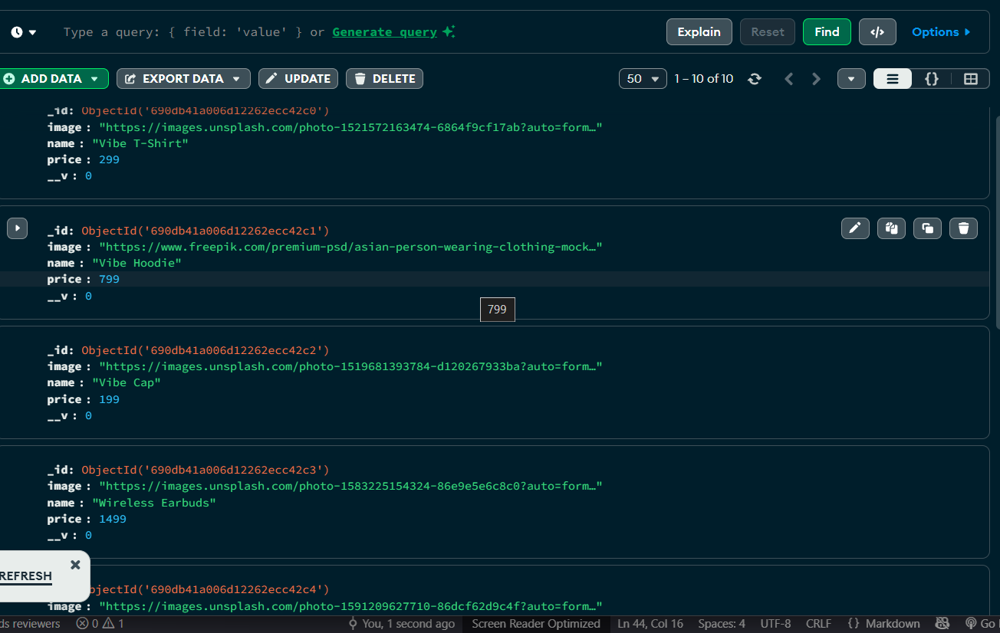

Hello I am Gautam So for assignment i made this project 

SetUp 
Git clone https://github.com/Gautam-Mahara/NexoraBackend.git
cd ./NexoraBackend
npm install express
npm install cors nodemon mongoose dotenv body-parser
Create a .env file in server.js level and paste your mongourl there
MONGO_URI = "yourstring"
Port = 
npm start

Working 
Server.js
It uses Cors i only allowed 3000 , 3001 if your frontend run on different port or url , paste the url in cors

In the File we are also connecting to our Db
On Reciving req for (/product) it will go to products.jsx
on "/cart" it will go to cart.jsx

Product.jsx
We are populating the Db if no data is present 
we get all product and send them back

product.jsx 
it is a product model or you can say schema it defines the structure of product object
name price image is there 
for id i am using default id provided by mongo

cart.jsx
it has 4 routes 
/ get for checking cart in this it return item from carditem db
/ post it adds item in card this add object to carditem db 
/ delete for deleting 
/ checkout it generate a success message and remove all the item from cart

cartitem.jsx 
it is a model for cart

Some Pics of db

!!!!!!!!!!!!!!!!!!!!!!!!!!!!!! Important !!!!!!!!!!!!!!!!!!!!!!!!!!!!!!!!!!!
if you face error with add to cart then please clear cartitems db

Author 
Gautam Singh Mahara